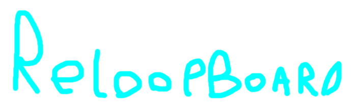
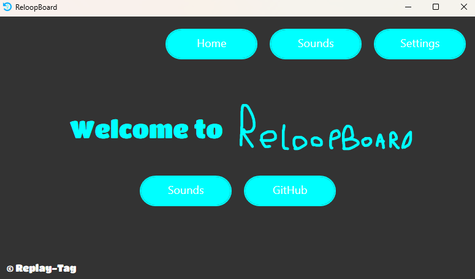

# ReloopBoard
free, open-source, soundboard thingy.

# Features

well you can add sounds and play sounds.. thats kinda it

saves sounds and settings through json

# Requirements
1. VB Audio-Cable (for the microphone output to play sounds on discore, games, etc.)

# Compiling

1. Clone this repository: `git clone https://github.com/Replay-Tag/ReloopBoard.git`
2. Build the project using Visual Studio 2022.
3. Use it.

# Roadmap

1. Plan to add shortcuts for sounds
2. idk.. stuff

# License

This project is licensed under the MIT License.

# For forking

if you are gonna fork this repository and modify ReloopBoard keep the "© Replay-Tag" textblock in the bottom left, DO NOT REMOVE IT! be kind and give credit.
